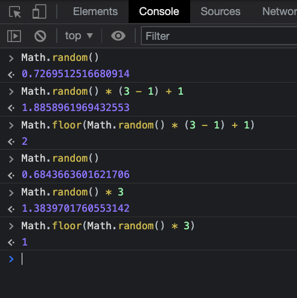

# Rock-Papper-Scissors challenge

In this aplication user can play rock-paper-scissors against an Imaginary Friend (aka computer).

### User stories

> As a user  
> In order to entertain myself  
> I want to play rock-paper-scissors with my imaginary friend

> As a user  
> In order to easily choose my next move  
> I want to see clearly my options

> As a user  
> In order to know what my imaginary friend chose  
> I want to see his/her choice

> As a user  
> In order to know which one of us won  
> I want to see results of the game

## The Code

Deployed version of this challenge: [Rock Paper Scissors](https://rockpaperscissors2021.netlify.app/)

Rock Paper Scissors is a simple game where you can play against Your Imaginary Friend. Well that is a computer but who wants to play against computers?

This screenshot gives a small insight how computer makes a choice:

## Dependencies

- Build with React
- Tested with Cypress
- Semantic UI for design
- Netlify for deployment

## Setup

You can clone this repo and run `yarn`

## Acknowledgements

- Craft Academy course material.
- Previous students from Craft Academy. Their code helped me understand how I could stub computers' choice.
- Cypress documentation also was used for testing computers' choice. [Cypress Documentation](https://docs.cypress.io/api/commands/stub#Syntax)
- [YouTube](https://www.youtube.com/watch?v=TIefmKAWMTo&list=WL&index=1)

## Updates/Improvements plans

Have different levels. More advanced levels would look into your choices and try to guess your next move.
